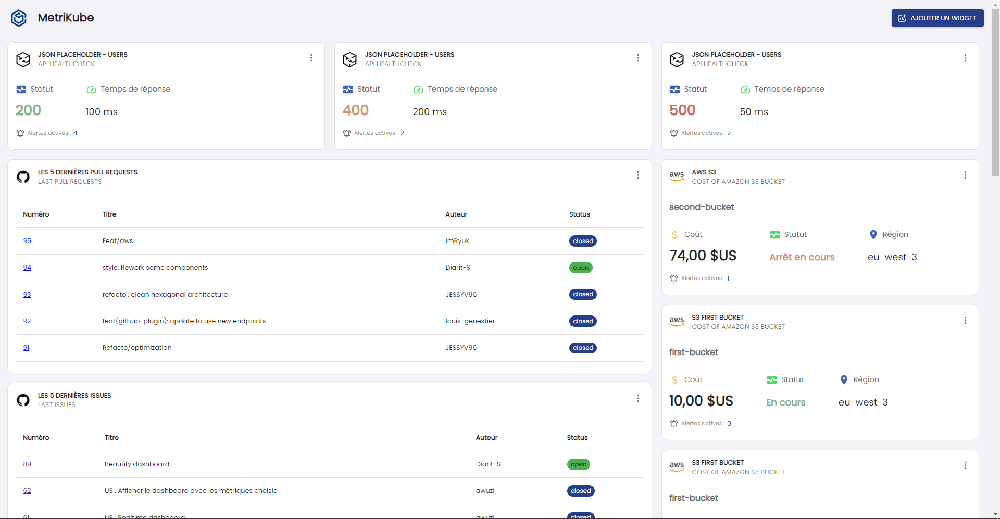

<br/>
<p align="center">
  <a href="https://github.com/metrikube/app">
    
  </a>

<h1 align="center">MetriKube</h3>

  <p align="center">
    Empower Developers with Comprehensive Ecosystem Monitoring.
    <br/>
    <br/>
    <a href="https://github.com/metrikube/app"><strong>Explore the docs »</strong></a>
    <br/>
    <br/>
    <a href="https://github.com/metrikube/app">View Demo</a>
    •
    <a href="https://github.com/metrikube/app/issues">Report Bug</a>
    •
    <a href="https://github.com/metrikube/app/issues">Request Feature</a>
  </p>
</p>

     

## Table Of Contents

---

* [About the Project](#about-the-project)
* [Built With](#built-with)
* [Getting Started](#getting-started)
  * [Prerequisites](#prerequisites)
  * [Installation](#installation)
* [Usage](#usage)
* [Roadmap](#roadmap)
* [Contributing](#contributing)
* [License](#license)
* [Authors](#authors)
* [Acknowledgements](#acknowledgements)

## About The Project

---



--- 

**Metrikube** solves the problem of scattered metrics monitoring in a development ecosystem. Our project centralizes essential data into a single dashboard, enabling developers to make informed decisions faster. Simplify monitoring, optimize resources and boost your team's productivity with Metrikube.

Here's why:

* **Streamlined Monitoring**: Say goodbye to the hassle of jumping between multiple tools. Metrikube centralizes your metrics, providing a unified view of your ecosystem, saving you time and effort.

* **Informed Decision-Making**: With all your essential data in one place, you can make informed decisions about development, maintenance, and continuous improvement, enhancing the overall quality of your projects.

* **Tailored Dashboards**: Customize your dashboard to display the metrics that matter most to you, giving you the flexibility to focus on what's important.

* **Real-Time Insights**: Metrikube offers real-time monitoring, ensuring you stay up-to-date with the latest developments in your projects, allowing you to respond swiftly to any issues that may arise.

* **Resource Optimization**: By providing insights into resource usage and bottlenecks, Metrikube helps you optimize costs and enhance the efficiency of your infrastructure.

* **Enhanced Productivity**: By eliminating the need to juggle multiple tools, Metrikube enhances your team's productivity, allowing them to focus on what they do best – building great software.


## Built With

---

* Typescript
* NestJS
* React
* NX Monorepo

## Getting Started

---

This is an example of how you may give instructions on setting up your project locally.
To get a local copy up and running follow these simple example steps.

### Prerequisites

This is an example of how to list things you need to use the software and how to install them.

* npm

```sh
npm install npm@latest -g
```

### Installation

1. Clone the repo

```sh
git clone https://github.com/metrikube/app.git
```

3. Install NPM packages

```sh
npm install
```

4. Initialize the Database

```sh
npm run db:init
```


## Usage

---

...wip

## Roadmap

---

See the [open issues](https://github.com/metrikube/app/issues) for a list of proposed features (and known issues).

## Contributing

---

### Creating A Pull Request

1. Fork the Project
2. Create your Feature Branch (`git checkout -b feature/AmazingFeature`)
3. Commit your Changes (`git commit -m 'Add some AmazingFeature'`)
4. Push to the Branch (`git push origin feature/AmazingFeature`)
5. Open a Pull Request

## License

---

Distributed under the MIT License. See [LICENSE](https://github.com/metrikube/app/blob/main/LICENSE.md) for more information.

## Authors

---

* [Clément JACQUELET](https://github.com/awuzi)
* [Diarit SALIHAJ](https://github.com/awuzi)
* [Jessy Vautour](https://github.com/JESSYV96)
* [Louis GENESTIER](https://github.com/awuzi)
* [Theotim HERIN](https://github.com/awuzi)
* [Yahia LAMRI](https://github.com/awuzi)

